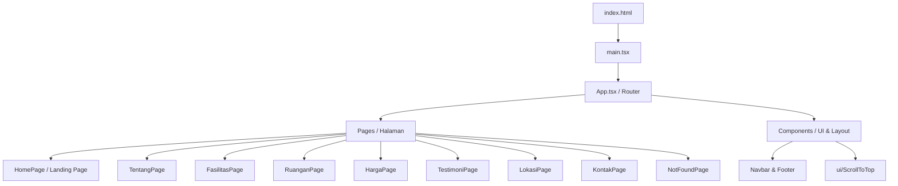
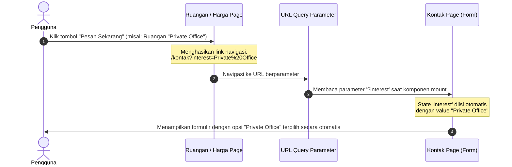
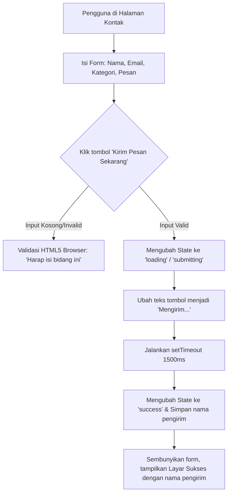

# FLOW BESAR APLIKASI — SPACEHUB COWORKING SPACE

Dokumen ini mendeskripsikan arsitektur sistem, peta navigasi (routing), diagram alir data (*data flow*), serta interaksi pengguna (*user flows*) pada aplikasi **SpaceHub Company Profile**. Dokumen ini dirancang sebagai referensi akademis untuk melengkapi bab metodologi atau analisis pada penelitian tesis Anda.

---

## 1. Arsitektur Umum & Teknologi Sistem

Aplikasi SpaceHub didevelop menggunakan arsitektur Single Page Application (SPA) berbasis komponen modular. Pemanfaatan teknologi terbaru menjamin performa cepat dan pengalaman pengguna yang halus.



### Stack Teknologi Utama:
* **Core Library**: React 19 (Rendering DOM dinamis & state management).
* **Compiler & Bundler**: Vite (Menggunakan HMR super cepat).
* **Styling Engine**: Tailwind CSS v4 (Sistem desain modern, transisi smooth, dan *glassmorphism*).
* **Routing**: React Router DOM (Navigasi halaman tanpa memuat ulang browser).
* **Testing Engine**: Vitest & React Testing Library (Untuk pengujian otomatis).

---

## 2. Peta Navigasi & Struktur Rute (SPA Routing Map)

Aplikasi SpaceHub memetakan 8 halaman utama ditambah 1 halaman penanganan kesalahan (404 Error Page). Semua perpindahan halaman diatur oleh React Router secara sinkron dengan fungsionalitas auto-scroll ke atas melalui komponen `ScrollToTop`.

| Rute URL | Nama Halaman | Komponen Target (`src/pages/`) | Deskripsi / Fungsi |
| :--- | :--- | :--- | :--- |
| `/` | Beranda (Home) | `HomePage.tsx` | Landing page utama yang mengintegrasikan cuplikan seluruh section. |
| `/tentang` | Tentang Kami | `TentangPage.tsx` | Profil perusahaan, visi-misi, dan tim pengembang SpaceHub. |
| `/fasilitas` | Fasilitas | `FasilitasPage.tsx` | Deskripsi mendalam mengenai fasilitas premium (Internet, Kopi, dsb.). |
| `/ruangan` | Tipe Ruangan | `RuanganPage.tsx` | Katalog tipe ruangan (Hot Desk, Dedicated Desk, Private Office). |
| `/harga` | Paket Harga | `HargaPage.tsx` | Daftar paket keanggotaan (membership plans) dan accordion FAQ. |
| `/testimoni` | Testimoni | `TestimoniPage.tsx` | Ulasan otentik dari para member dan komunitas SpaceHub. |
| `/lokasi` | Lokasi Cabang | `LokasiPage.tsx` | Peta interaktif dan daftar cabang fisik SpaceHub. |
| `/kontak` | Hubungi Kami | `KontakPage.tsx` | Formulir reservasi tur, feedback, dan kontak bantuan. |
| `*` (Wildcard) | Halaman 404 | `NotFoundPage.tsx` | Penanganan rute yang tidak valid / tidak terdaftar. |

---

## 3. Alur Interaksi Kunci (Key User Flows)

Ada tiga alur interaksi kompleks di dalam aplikasi SpaceHub yang menghubungkan state antar komponen:

### A. Alur Reservasi Kontekstual (Contextual Booking Flow)
Alur ini memindahkan data pilihan pengguna dari Halaman Ruangan/Harga secara dinamis ke Formulir Kontak agar pengguna tidak perlu memilih ulang secara manual.



### B. Alur Pengiriman Formulir Kontak (Form Submission Flow)
Proses pengiriman formulir disimulasikan menggunakan delay asinkron (1.5 detik) untuk memberikan efek interaksi dengan backend (API Mocking).



### C. Alur FAQ Accordion (Expand/Collapse Flow)
Alur interaksi pada komponen FAQ di Halaman Harga yang menggunakan CSS transition untuk animasi mulus.

```mermaid
graph TD
    A[FAQ Tertutup: Ketinggian kontainer max-h-0 & opacity-0] --> B[Pengguna klik judul Pertanyaan FAQ]
    B --> C{Apakah FAQ sudah terbuka?}
    C -->|Ya| D[Set activeId ke null -> Tutup FAQ]
    C -->|Tidak| E[Set activeId ke ID pertanyaan -> Buka FAQ]
    D --> F[Animasi CSS: max-h-0, opacity-0, ikon panah berputar kembali ke 0°]
    E --> G[Animasi CSS: max-h-[200px], opacity-100, ikon panah berputar 180°]
```

---

## 4. Siklus Hidup dan Pengujian Aplikasi

Di dalam siklus pengembangan (*software development lifecycle*), flow aplikasi ini dijaga kualitasnya menggunakan dua metode pengujian terintegrasi:

1. **Manual Testing Loop**: Penguji memvalidasi elemen visual (desain premium, kontras warna tombol, responsivitas layar mobile) dan alur navigasi SPA secara langsung pada berbagai browser.
2. **Automated Testing Loop (Vitest + RTL)**: 
   * **Smoke Test**: Memastikan seluruh halaman (`HomePage` s.d. `NotFoundPage`) sukses di-render (*mount*) tanpa melempar error.
   * **Behavioral & Time-based Test**: Memotong waktu tunggu 1.5 detik formulir menjadi instan (< 2ms) menggunakan `Fake Timers` untuk memverifikasi transisi state secara cepat dan deterministik sebelum aplikasi di-*build* ke lingkungan produksi.
